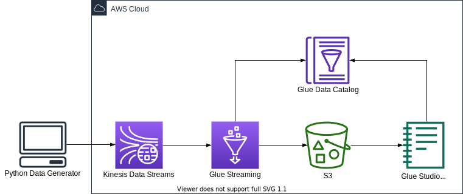

# AWS Glue Streaming ETL Job with Delta Lake CDK Python project!



In this project, we create a streaming ETL job in AWS Glue to integrate [Delta Lake](https://docs.delta.io/latest/index.html) with a streaming use case and create an in-place updatable data lake on Amazon S3.


This project can be deployed with [AWS CDK Python](https://docs.aws.amazon.com/cdk/api/v2/).

The `cdk.json` file tells the CDK Toolkit how to execute your app.

This project is set up like a standard Python project.  The initialization
process also creates a virtualenv within this project, stored under the `.venv`
directory.  To create the virtualenv it assumes that there is a `python3`
(or `python` for Windows) executable in your path with access to the `venv`
package. If for any reason the automatic creation of the virtualenv fails,
you can create the virtualenv manually.

To manually create a virtualenv on MacOS and Linux:

```
$ python3 -m venv .venv
```

After the init process completes and the virtualenv is created, you can use the following
step to activate your virtualenv.

```
$ source .venv/bin/activate
```

If you are a Windows platform, you would activate the virtualenv like this:

```
% .venv\Scripts\activate.bat
```

Once the virtualenv is activated, you can install the required dependencies.

```
(.venv) $ pip install -r requirements.txt
```

In case of `AWS Glue 3.0`, before synthesizing the CloudFormation, **you first set up Delta Lake connector for AWS Glue to use Delta Lake with AWS Glue jobs.** (For more information, see [References](#references) (2))

Update the cdk context configuration file, `cdk.context.json`.

For example:
<pre>
{
  "kinesis_stream_name": "deltalake-demo-stream",
  "glue_assets_s3_bucket_name": "aws-glue-assets-rm-demo",
  "glue_job_script_file_name": "spark_kinesis_to_deltalake_publisher.py",
  "glue_job_name": "streaming_data_from_kds_into_deltalake_table",
  "glue_job_input_arguments": {
    "--catalog": "spark_catalog",
    "--database_name": "deltalake_db",
    "--table_name": "products",
    "--primary_key": "product_id",
    "--partition_key": "category",
    "--kinesis_database_name": "deltalake_stream_db",
    "--kinesis_table_name": "kinesis_stream_table",
    "--starting_position_of_kinesis_iterator": "LATEST",
    "--delta_s3_path": "s3://glue-deltalake-rm-demo-us-east-1/deltalake_db/products",
    "--aws_region": "us-east-1",
    "--window_size": "100 seconds",
    "--extra-jars": "s3://aws-glue-assets-123456789012-atq4q5u/extra-jars/aws-sdk-java-2.17.224.jar",
    "--user-jars-first": "true"
  },
  "glue_connections_name": "deltalake-connector-1_0_0",
  "glue_kinesis_table": {
    "database_name": "deltalake_stream_db",
    "table_name": "kinesis_stream_table",
    "columns": [
      {
        "name": "product_id",
        "type": "string"
      },
      {
        "name": "product_name",
        "type": "string"
      },
      {
        "name": "price",
        "type": "int"
      },
      {
        "name": "category",
        "type": "string"
      },
      {
        "name": "updated_at",
        "type": "string"
      }
    ]
  }
}
</pre>

:information_source: `--primary_key` option should be set by Delta Lake table's primary column name.

:information_source: `--partition_key` option should be set by Delta Lake table's column name for partitioning.

:warning: **You should create a S3 bucket for a glue job script and upload the glue job script file into the s3 bucket.**

At this point you can now synthesize the CloudFormation template for this code.

<pre>
(.venv) $ export CDK_DEFAULT_ACCOUNT=$(aws sts get-caller-identity --query Account --output text)
(.venv) $ export CDK_DEFAULT_REGION=$(aws configure get region)
(.venv) $ cdk synth --all
</pre>

To add additional dependencies, for example other CDK libraries, just add
them to your `setup.py` file and rerun the `pip install -r requirements.txt`
command.

## Run Test

1. Set up **Delta Lake connector for AWS Glue** to use Delta Lake with AWS Glue jobs.
   <pre>
   (.venv) $ cdk deploy GlueDeltaLakeConnection
   </pre>
2. Create a S3 bucket for Delta Lake table
   <pre>
   (.venv) $ cdk deploy DeltaLakeS3Path
   </pre>
3. Create a Kinesis data stream
   <pre>
   (.venv) $ cdk deploy KinesisStreamAsGlueStreamingJobDataSource
   </pre>
4. Define a schema for the streaming data
   <pre>
   (.venv) $ cdk deploy GlueSchemaOnKinesisStream
   </pre>

5. Create Database in Glue Data Catalog for Delta Lake table
   <pre>
   (.venv) $ cdk deploy GlueSchemaOnDeltaLake
   </pre>
6. Upload **AWS SDK for Java 2.x** jar file into S3
   <pre>
   (.venv) $ wget https://repo1.maven.org/maven2/software/amazon/awssdk/aws-sdk-java/2.17.224/aws-sdk-java-2.17.224.jar
   (.venv) $ aws s3 cp aws-sdk-java-2.17.224.jar s3://aws-glue-assets-123456789012-atq4q5u/extra-jars/aws-sdk-java-2.17.224.jar
   </pre>
7. Create Glue Streaming Job

   * (step 1) Select one of Glue Job Scripts and upload into S3

     **List of Glue Job Scirpts**
     | File name | Spark Writes |
     |-----------|--------------|
     | spark_deltalake_writes_with_dataframe.py | DataFrame append |
     | spark_deltalake_writes_with_sql_insert_overwrite.py | SQL insert overwrite |
     | spark_deltalake_writes_with_sql_merge_into.py | SQL merge into |

     <pre>
     (.venv) $ ls src/main/python/
      spark_deltalake_writes_with_dataframe.py
      spark_deltalake_writes_with_sql_insert_overwrite.py
      spark_deltalake_writes_with_sql_merge_into.py
     (.venv) $ aws s3 mb <i>s3://aws-glue-assets-rm-demo</i> --region <i>us-east-1</i>
     (.venv) $ aws s3 cp src/main/python/spark_deltalake_writes_with_sql_merge_into.py <i>s3://aws-glue-assets-rm-demo/scripts/</i>
     </pre>

   * (step 2) Provision the Glue Streaming Job

     <pre>
     (.venv) $ cdk deploy GlueStreamingSinkToDeltaLakeJobRole \
                          GrantLFPermissionsOnGlueJobRole \
                          GlueStreamingSinkToDeltaLake
     </pre>
8. Make sure the glue job to access the Kinesis Data Streams table in the Glue Catalog database, otherwise grant the glue job to permissions

   We can get permissions by running the following command:
   <pre>
   (.venv) $ aws lakeformation list-permissions | jq -r '.PrincipalResourcePermissions[] | select(.Principal.DataLakePrincipalIdentifier | endswith(":role/GlueStreamingJobRole-DeltaLake"))'
   </pre>
   If not found, we need manually to grant the glue job to required permissions by running the following command:
   <pre>
   (.venv) $ aws lakeformation grant-permissions \
               --principal DataLakePrincipalIdentifier=arn:aws:iam::<i>{account-id}</i>:role/<i>GlueStreamingJobRole-DeltaLake</i> \
               --permissions CREATE_TABLE DESCRIBE ALTER DROP \
               --resource '{ "Database": { "Name": "<i>deltalake_db</i>" } }'
   (.venv) $ aws lakeformation grant-permissions \
               --principal DataLakePrincipalIdentifier=arn:aws:iam::<i>{account-id}</i>:role/<i>GlueStreamingJobRole-DeltaLake</i> \
               --permissions SELECT DESCRIBE ALTER INSERT DELETE \
               --resource '{ "Table": {"DatabaseName": "<i>deltalake_db</i>", "TableWildcard": {}} }'
   </pre>

9.  Run glue job to load data from Kinesis Data Streams into S3
    <pre>
    (.venv) $ aws glue start-job-run --job-name <i>streaming_data_from_kds_into_deltalake_table</i>
    </pre>
10. Generate streaming data

    We can synthetically generate data in JSON format using a simple Python application.
    <pre>
    (.venv) $ python src/utils/gen_fake_kinesis_stream_data.py \
               --region-name <i>us-east-1</i> \
               --stream-name <i>your-stream-name</i> \
               --console \
               --max-count 10
    </pre>

## Clean Up

1. Stop the glue job by replacing the job name in below command.

   <pre>
   (.venv) $ JOB_RUN_IDS=$(aws glue get-job-runs \
              --job-name streaming_data_from_kds_into_deltalake_table | jq -r '.JobRuns[] | select(.JobRunState=="RUNNING") | .Id' \
              | xargs)
   (.venv) $ aws glue batch-stop-job-run \
              --job-name streaming_data_from_kds_into_deltalake_table \
              --job-run-ids $JOB_RUN_IDS
   </pre>

2. Delete the CloudFormation stack by running the below command.

   <pre>
   (.venv) $ cdk destroy --all
   </pre>


See [CONTRIBUTING](CONTRIBUTING.md#security-issue-notifications) for more information.

## License

This library is licensed under the MIT-0 License. See the LICENSE file.

